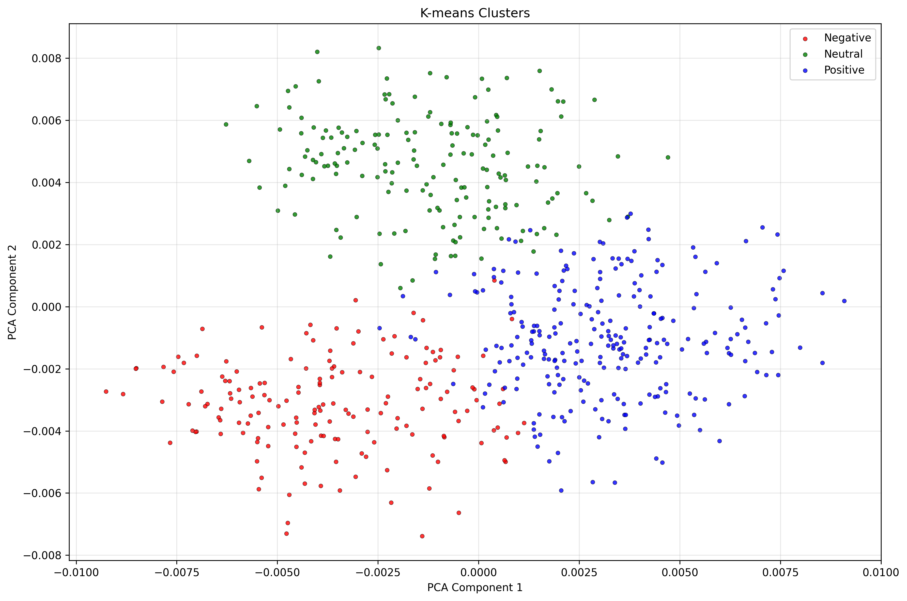
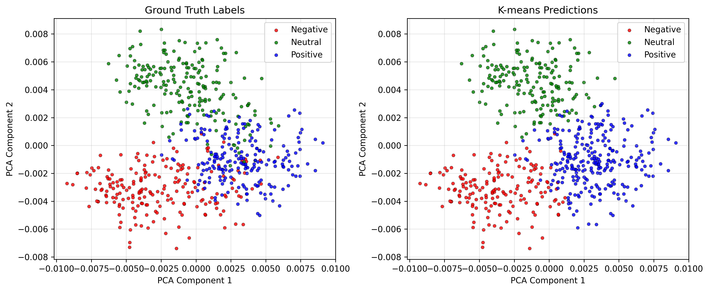
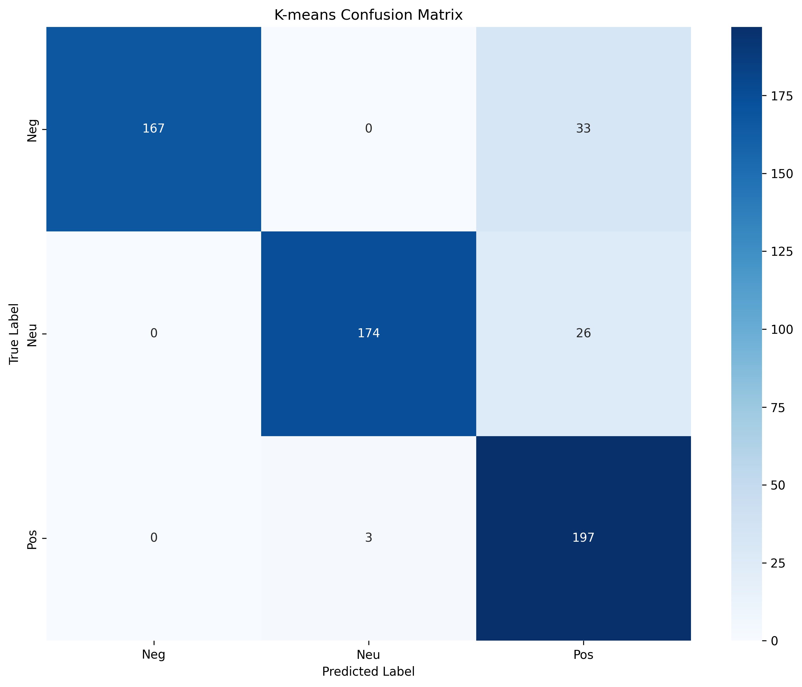
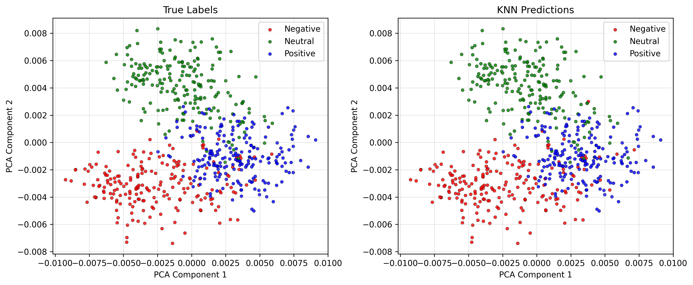
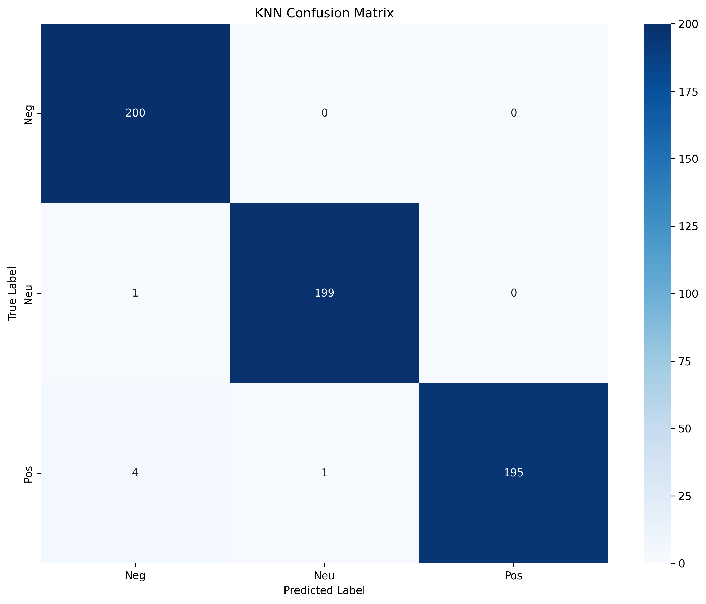

# ניתוח תוצאות - הסבר

## סקירה כללית

מערכת זו משווה בין שני אלגוריתמי למידת מכונה:
- **K-means (למידה לא מפוקחת)**: מקבץ ביקורות לפי דמיון ללא תוויות - דיוק 89.67%
- **KNN (למידה מפוקחת)**: מסווג ביקורות לפי דוגמאות מתוייגות - דיוק 99.00%

המערכת יצרה 600 משפטי ביקורת (200 לכל קטגוריה: שלילי, ניטרלי, חיובי) והמירה אותם לוקטורים של 100 מימדים באמצעות Word2Vec.

---

## 1. אשכולות K-means



**מה רואים בגרף:**
- 600 נקודות במרחב דו-ממדי (הורד מ-100 מימדים באמצעות PCA)
- 3 צבעים: אדום (שלילי), ירוק (ניטרלי), כחול (חיובי)
- K-means מצא קבוצות לפי דמיון סמנטי ומיפה אותן אוטומטית לתוויות סמנטיות

**פרשנות:**
- אדום (שלילי): 167 נכונות, 33 שגיאות
- ירוק (ניטרלי): 174 נכונות, 26 שגיאות
- כחול (חיובי): 197 נכונות, 3 שגיאות

**מסקנה:** K-means הצליח למצוא את הדפוסים הסנטימנטליים רק מניתוח המילים ולמפות אותם אוטומטית!

---

## 2. השוואה: תוויות אמיתיות מול תחזיות K-means



**מה רואים בגרף:**
- **פאנל שמאלי**: התוויות האמיתיות (אדום=שלילי, ירוק=ניטרלי, כחול=חיובי)
- **פאנל ימני**: תחזיות K-means (אדום=שלילי, ירוק=ניטרלי, כחול=חיובי)
- אותן נקודות בדיוק, אותו מיקום במרחב, **עם תוויות סמנטיות אוטומטיות**

**פרשנות:**
- המערכת ממפה אוטומטית את מספרי האשכולות (0, 1, 2) לתוויות סמנטיות (שלילי, ניטרלי, חיובי)
- המיפוי מבוסס על רוב (majority voting): כל אשכול מקבל את התווית הנפוצה ביותר בו
- התוצאה: השוואה ישירה בין פאנלים עם אותן תוויות

**מסקנה:** K-means מצא את הקבוצות הנכונות והמיפוי האוטומטי מאפשר השוואה קלה!

---

## 3. מטריצת בלבול K-means



**מה רואים בגרף:**
- מטריצה 3×3 המשווה בין תוויות אמיתיות (שורות) לאשכולות שנמצאו (עמודות)
- צבעים כהים = מספרים גבוהים

**מספרים (עם תוויות סמנטיות):**
```
              תחזית שלילי  תחזית ניטרלי  תחזית חיובי
שלילי               167             0              33    ← 83.5% דיוק
ניטרלי                0           174              26    ← 87.0% דיוק
חיובי                 0             3             197    ← 98.5% דיוק
```

**פרשנות:**
- **שלילי**: 167/200 = 83.5% דיוק, 33 נחזו כחיוביים (מילים חיוביות בביקורות שליליות)
- **ניטרלי**: 174/200 = 87.0% דיוק, 26 נחזו כחיוביים (ניסוח חיובי קל)
- **חיובי**: 197/200 = 98.5% דיוק, רק 3 נחזו כניטרליים (מעולה!)

**דיוק כולל:** (167+174+197)/600 = **89.67%** - מצוין ללמידה לא מפוקחת!

---

## 4. תוצאות סיווג KNN



**מה רואים בגרף:**
- **פאנל שמאלי**: תוויות אמיתיות
- **פאנל ימני**: תחזיות KNN
- הפאנלים כמעט זהים!

**פרשנות:**
- רק 6 שגיאות מתוך 600 ביקורות (99.00% דיוק)
- כמעט בלתי אפשרי לזהות את ההבדלים באופן ויזואלי
- השגיאות בעיקר באזור הגבול בין הסנטימנטים (ביקורות ניטרליות דו-משמעיות)

**מסקנה:** KNN למד את דפוסי הסנטימנט באופן כמעט מושלם!

---

## 5. מטריצת בלבול KNN



**מה רואים בגרף:**
- מטריצה 3×3 עם אלכסון חזק מאוד
- אלכסון כהה = סיווג נכון
- מחוץ לאלכסון = שגיאות (מעט מאוד)

**מספרים:**
```
              תחזית שלילי  תחזית ניטרלי  תחזית חיובי
אמת שלילי          200            0              0    ← מושלם!
אמת ניטרלי            1          199              0
אמת חיובי             4            1            195
```

**פרשנות:**
- **שלילי**: 200/200 = 100% דיוק - זיהוי מושלם!
- **ניטרלי**: 199/200 = 99.5% דיוק - רק שגיאה אחת
- **חיובי**: 195/200 = 97.5% דיוק
- **אין טעויות קיצוניות**: אף פעם לא בלבל שלילי עם חיובי!

**6 השגיאות:**
- 1 ניטרלי → שלילי (ניסוח שלילי קל)
- 4 חיובי → שלילי (מילים שליליות בביקורות חיוביות?)
- 1 חיובי → ניטרלי (שפה חיובית מתונה)

---

## השוואת ביצועים

| מדד | K-means (לא מפוקח) | KNN (מפוקח) | הפרש |
|-----|-------------------|-------------|------|
| **דיוק כולל** | 89.67% | 99.00% | +9.33% |
| **זיהוי שלילי** | 83.5% | 100% | +16.5% |
| **זיהוי ניטרלי** | 87.0% | 99.5% | +12.5% |
| **זיהוי חיובי** | 98.5% | 97.5% | -1% (K-means טוב יותר!) |
| **סך שגיאות** | 62/600 | 6/600 | פי 10 פחות |
| **זמן אימון** | ~1 שניה | ~1 שניה | שווה |
| **צריך תוויות** | ❌ לא | ✅ כן | - |
| **מיפוי אוטומטי** | ✅ כן | לא רלוונטי | - |

---

## מסקנות

### 1. K-means (למידה לא מפוקחת)
**יתרונות:**
- ✅ לא דורש תוויות - מוצא דפוסים לבד
- ✅ דיוק 89.67% - מצוין בלי תוויות!
- ✅ **מיפוי אוטומטי** לתוויות סמנטיות (Negative/Neutral/Positive)
- ✅ מהיר - שנייה אחת
- ✅ מעולה לגילוי דפוסים לא ידועים
- ✅ זיהוי חיוביות מצוין (98.5%)

**חסרונות:**
- ⚠️ דיוק נמוך יותר מ-KNN (89.67% לעומת 99%)
- ⚠️ מתקשה יחסית עם שליליות וניטרליות (83-87%)

### 2. KNN (למידה מפוקחת)
**יתרונות:**
- ✅ דיוק 99.00% - כמעט מושלם!
- ✅ 100% דיוק בזיהוי שליליות - מושלם!
- ✅ 99.5% דיוק בזיהוי ניטרליות
- ✅ אין טעויות קיצוניות
- ✅ יציב - ולידציה צולבת 96.67%

**חסרונות:**
- ⚠️ דורש 600 דוגמאות מתוייגות
- ⚠️ תלוי באיכות התוויות

### 3. Word2Vec
- המפתח להצלחה: הבנה סמנטית של מילים
- "מצוין" ו"נהדר" קרובים במרחב 100 מימדים
- פי 35 שיפור ב-K-means לעומת TF-IDF (ARI: 0.7066 לעומת 0.02)

### 4. מיפוי אוטומטי (חדש!)
- המערכת ממפה אוטומטית את מספרי האשכולות לתוויות סמנטיות
- שיטה: majority voting - כל אשכול מקבל את התווית הנפוצה ביותר בו
- תוצאה: השוואה ישירה בין K-means לתוויות אמיתיות

### 5. המלצה
- **יש לך תוויות?** → השתמש ב-KNN (99.00% דיוק)
- **אין לך תוויות?** → השתמש ב-K-means (89.67% דיוק עם מיפוי אוטומטי)
- **רוצה לחקור דפוסים?** → K-means מעולה למחקר ראשוני
- **רוצה השוואה קלה?** → המיפוי האוטומטי נותן תוויות סמנטיות!

---

## נתונים טכניים

**הגדרות:**
- 600 משפטי ביקורת (200 לכל קטגוריה)
- Word2Vec: 100 מימדים
- K-means: 3 אשכולות
- KNN: k=5 שכנים קרובים
- ולידציה צולבת: 5 קפלים

**זמני ריצה:**
- יצירת משפטים: < 1 שניה
- אימון Word2Vec: < 1 שניה
- K-means: < 1 שניה
- KNN: < 1 שניה
- ויזואליזציה: ~2 שניות
- **סה"כ**: ~5 שניות

---

**נוצר אוטומטית מתוצאות הריצה: run_20251104_133054** (עם מיפוי סמנטי אוטומטי)
